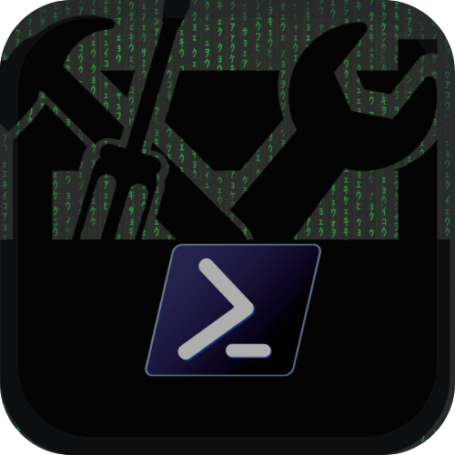

# 

<div align="Left">
  <a href="https://www.powershellgallery.com/packages/PsCraft"><b>PsCraft</b></a>
  <p>
    A toolbox to accelerate common tasks involved in <b>developing and sharing PowerShell code</b>.
    </br></br>
    <a href="https://github.com/alainQtec/PsCraft/actions/workflows/CI.yaml">
    
    </a>
    
    <a href="https://github.com/alainQtec/PsCraft/actions/workflows/Publish.yaml">
    </a>
    <a href="https://www.PowerShellGallery.com/packages/PsCraft">
    
    </a>
  </p>
</div>

## **Usage**

- Install from Powershell Gallery:

  ```PowerShell
  Install-Module PsCraft
  ```
- then .. Create, test, build, deploy 🚀.
  
  ⤷ Ex: **You can create a [script module](https://learn.microsoft.com/en-us/powershell/scripting/developer/module/how-to-write-a-powershell-script-module) in unders 5 seconds!**
    <video controls autoplay src="https://github.com/user-attachments/assets/c4373930-ef94-45aa-99de-26b7f5e6cb49" width="320" height="240" controls>Your browser does not support the video tag.</video>
  `Its only one comand`:

  ```PowerShell
  $module = New-PsModule "CliHelper.Core"
  ```

  (づ ᴗ _ᴗ)づ haleluːjə!

For more usage read the [docs](/docs/Readme.md). they pretty easy!

**Features (W.I.P) :**

- [x] **Create & Manage** modules: Using
      [`PsCraft.ModuleManager`](Private/PsCraft.ModuleManager/PsCraft.ModuleManager.psm1)

- [ ] Add **CodeSigning** Functions: `PsCraft.CodeSigner.psm1`

  <p>Cross-platform <a href ="https://learn.microsoft.com/en-us/previous-versions/windows/hardware/design/dn653556(v=vs.85)">code signing</a>.</p>

  <p>Sign your modules and scripts with digital signatures for enhanced <a href ="https://learn.microsoft.com/en-us/powershell/module/microsoft.powershell.core/about/about_signing?view=powershell-7.4">security and trust</a></p>

- [ ] **Build GUIs faster**: `PsCraft.GuiBuilder.psm1`

  A module to create intuitive graphical interfaces for your modules.

<p>And other todos not mentioned here. Use <a href="https://marketplace.visualstudio.com/items?itemName=Gruntfuggly.todo-tree">todo tree</a> to find all of them.</p>

## License

<p>This project is licensed under the MIT License - Read
 <a href="https://alain.MIT-license.org">License</a> for details. </p>

## Contributing

Pull requests are welcome! You can also contribute to this module by
[sharing opinions, and providing feedback](https://github.com/alainQtec/PsCraft/discussions/2).


